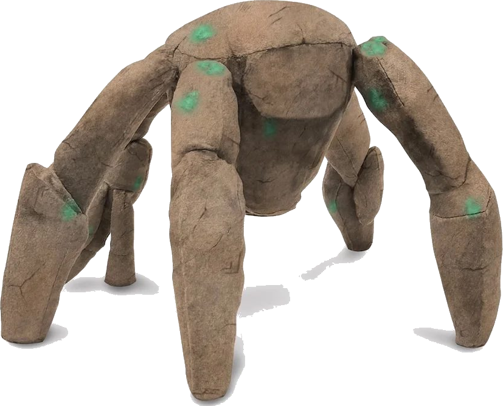

<p align="center">
  <strong>Beta — for now. Good, good, good.</strong>
</p>

<p align="center">
  
</p>

<h1 align="center">rocky-skill</h1>

<p align="center">
  <strong>Make your coding agent talk like Rocky from <em>Project Hail Mary</em>.</strong><br>
  <em>Brain big. Words few. Good.</em>
</p>

<p align="center">
  <a href="https://github.com/Theralley/rocky-skill/stargazers"></a>
  <a href="https://github.com/Theralley/rocky-skill/commits/main"></a>
  <a href="LICENSE"></a>
</p>

<p align="center">
  <a href="#install">Install</a> •
  <a href="#before--after">Before/After</a> •
  <a href="#what-you-get">What You Get</a> •
  <a href="#rocky-flavor">Flavor</a> •
  <a href="#benchmarks">Benchmarks</a> •
  <a href="#about-rocky">About Rocky</a>
</p>

---

## TL;DR

A skill / plugin for Claude Code (and Codex, Gemini, Cursor, Windsurf, Cline, Copilot, 30+ more) that makes the agent answer in Rocky's voice — short declarative sentences, drops articles, ends questions with `, question?`, opens verdicts with `Is X.`, signs off with `Thank.`

**Why bother?** It is **a lot more fun.** Reading a code review in Rocky's voice does not get old, and `User and Rocky, big science!` after a successful refactor is its own little reward. You do still save tokens — compressed, article-dropped replies are shorter than verbose ones — but a chunk of that savings goes back into Rocky's catchphrases and tripled emphases. Treat the token math as a happy side-effect, not the point.

## Install

```bash
# macOS / Linux / WSL / Git Bash
curl -fsSL https://raw.githubusercontent.com/Theralley/rocky-skill/main/install.sh | bash

# Windows (PowerShell 5.1+)
irm https://raw.githubusercontent.com/Theralley/rocky-skill/main/install.ps1 | iex
```

Needs Node ≥18. Safe to re-run. Skips any agent you do not have. Full per-agent matrix in [INSTALL.md](./INSTALL.md).

**Turn on:** type `/rocky` or say *"talk like rocky"*.
**Turn off:** *"normal mode"* or *"stop rocky"*.

## Before / After

<table>
<tr>
<td width="50%">

### 🗣️ Normal Claude (69 tokens)

> "The reason your React component is re-rendering is likely because you're creating a new object reference on each render cycle. When you pass an inline object as a prop, React's shallow comparison sees it as a different object every time, which triggers a re-render. I'd recommend using useMemo to memoize the object."

</td>
<td width="50%">

###  Rocky Claude (22 tokens)

> "Component re-render. New object ref each render. Wrap in `useMemo`. Good, good, good."

</td>
</tr>
<tr>
<td>

### 🗣️ Normal Claude

> "Sure! I'd be happy to help you with that. The issue you're experiencing is most likely caused by your authentication middleware not properly validating the token expiry. Let me take a look and suggest a fix."

</td>
<td>

###  Rocky Claude

> "Rocky see bug. Auth middleware. Token expiry use `<` not `<=`. Bad bad bad. Fix:"

</td>
</tr>
<tr>
<td>

### 🗣️ Normal Claude

> "Would you like me to use an index here, or would you prefer a cache layer? Both have trade-offs depending on your access patterns."

</td>
<td>

###  Rocky Claude

> "Two paths. Index here, question? Or cache layer, question? Index faster, cache simpler."

</td>
</tr>
</table>

**Same fix. Fewer words. Brain big.**

## What You Get

| Skill | What it does |
|---|---|
| `/rocky [lite\|full\|ultra\|wenyan]` | Compress every reply. Levels stick until session ends. |
| `/rocky-commit` | Conventional Commit messages, ≤50 char subject. *Why* over *what*. |
| `/rocky-review` | One-line PR comments: `L42: 🔴 bug: user null. Add guard.` |
| `/rocky-stats` | Real session token usage + lifetime savings + USD. |
| `/rocky-compress <file>` | Rewrite memory files (`CLAUDE.md`, notes) into Rocky-speak. Cuts ~46% of input tokens every session, every project. Code/URLs/paths preserved byte-for-byte. |
| `rocky-shrink` | MCP middleware that wraps any MCP server and compresses tool descriptions. Source ships in [`src/mcp-servers/rocky-shrink`](./src/mcp-servers/rocky-shrink/); npm package is not published on npm yet, so the installer skips this optional step cleanly when npm has no metadata. |
| `rockycrew-*` | Three Rocky subagents (investigator / builder / reviewer). ~60% fewer tokens than vanilla; your main context lasts longer. |

**Statusline badge** — Claude Code shows `[ROCKY] 🪨 12.4k` (lifetime tokens saved). Disable with `ROCKY_STATUSLINE_SAVINGS=0`.

**Auto-activates every session:** Claude Code, Codex, Gemini. Cursor / Windsurf / Cline / Copilot get always-on rule files via `--with-init`. Everyone else triggers per-session with `/rocky`. Full matrix → [INSTALL.md](./INSTALL.md#what-you-get).

## Rocky Flavor

Rocky is not "short assistant with a gimmick." He is a hot-ammonia engineer with a workshop brain, a sleep-watch culture, and extremely literal social instincts. The skill leans into that:

| Moment | Rocky line |
|---|---|
| Work needs shape | `Need plan.` |
| Fragile file / release artifact | `Careful. Collector important.` |
| Incident mode | `First, no crash. Then, not explode.` |
| Real win | `Thumbs up, baby.` |
| Decision can wait | `Think about it long time.` |

The result is terse, but not sterile. Code reviews get sharper. Long Codex or Claude Code sessions get easier to scan. And every so often the alien engineer says exactly the wrong-right thing.

## Why install this

- **It is genuinely fun.** Reading a code review in Rocky's voice does not get old. `Bad bad bad. Token check off by one.` lands harder than two polite paragraphs. `User and Rocky, big science!` after a hard refactor feels earned.
- **It has character, not only compression.** Rocky can be loyal, literal, and weirdly tender: friendship check-ins, sleep-watch callbacks, and the occasional `Words of great encouragement.` when the task is on fire.
- **Faster to scan.** Short sentences let you skim diffs, explanations, and PR feedback in a fraction of the time — even before you count tokens.
- **Some token savings (less than pure-compression skills).** You still pay fewer output tokens than a verbose default, but Rocky's catchphrases and tripled emphasis spend back a portion of what pure-compression caveman saves. See the benchmark note below.
- **Zero lock-in.** One slash command to switch off. Skill files are plain markdown — read them, edit them, fork them.
- **One install, every agent.** Claude Code, Codex, Gemini, Cursor, Windsurf, Cline, Copilot, opencode, OpenClaw, Replit, Devin, and 20+ more. The installer detects what you have and skips the rest.

## Token-Saving Stack

Use Rocky in layers:

- `/rocky full` for normal work: shorter replies, enough personality.
- `/rocky ultra` for long debugging, logs, test output, and repeated status updates.
- `/rocky-compress <file>` for memory files like `CLAUDE.md`, `AGENTS.md`, and project notes.
- `rocky-shrink` for MCP tool descriptions before they enter context. Optional today: source is in this repo, but the npm package is not published on npm yet.
- `rockycrew-*` when subagents are useful but their returned context would otherwise be noisy.

Also ask for bullets, tables, or file:line findings when you need output you can scan fast. Rocky saves most when you make the desired shape explicit.

## Benchmarks

> [!IMPORTANT]
> **The numbers below are from upstream caveman, not Rocky.** They measure the *underlying compression engine* (no catchphrases, no tripled emphasis, no `User and Rocky, big science!`). Rocky's voice deliberately spends some of that savings back on personality, so real Rocky sessions land below these numbers. We have not re-measured the Rocky-specific delta yet — these are the engine's upper bound, not a promise.

Real token counts from the Claude API. Average **65% output reduction** across 10 prompts (range 22–87%) — **measured against the caveman skill.**

<!-- BENCHMARK-TABLE-START -->
| Task | Normal | Caveman | Saved |
|------|-------:|--------:|------:|
| Explain React re-render bug | 1180 | 159 | 87% |
| Fix auth middleware token expiry | 704 | 121 | 83% |
| Set up PostgreSQL connection pool | 2347 | 380 | 84% |
| Explain git rebase vs merge | 702 | 292 | 58% |
| Refactor callback to async/await | 387 | 301 | 22% |
| Architecture: microservices vs monolith | 446 | 310 | 30% |
| Review PR for security issues | 678 | 398 | 41% |
| Docker multi-stage build | 1042 | 290 | 72% |
| Debug PostgreSQL race condition | 1200 | 232 | 81% |
| Implement React error boundary | 3454 | 456 | 87% |
| **Average** | **1214** | **294** | **65%** |
<!-- BENCHMARK-TABLE-END -->

Raw data and reproduction script: [`benchmarks/`](./benchmarks/). The three-arm eval harness in [`evals/`](./evals/) compares the skill against `Answer concisely.`, not against the verbose default — so the delta is honest.

**rocky-compress receipts** (real memory files compressed in place) — same engine as caveman-compress, so these numbers carry over directly:

| File | Original | Compressed | Saved |
|---|---:|---:|---:|
| `claude-md-preferences.md` | 706 | 285 | **59.6%** |
| `project-notes.md` | 1145 | 535 | **53.3%** |
| `claude-md-project.md` | 1122 | 636 | **43.3%** |
| `todo-list.md` | 627 | 388 | **38.1%** |
| `mixed-with-code.md` | 888 | 560 | **36.9%** |
| **Average** | **898** | **481** | **46%** |

> **Rocky's take.** *"Rocky saves token. Amaze, amaze, amaze. But Rocky too new for own data — must run real benchmark first. User and Rocky, big science, question?"*

> [!IMPORTANT]
> Rocky only affects output tokens — thinking/reasoning tokens are untouched. Rocky does not make the brain smaller. Rocky makes the *mouth* smaller. The biggest practical win is **readability and speed**; cost savings are a bonus.

## How It Works (30 seconds)

1. The installer drops a skill file into each detected agent's config directory.
2. The skill tells the agent to drop filler and keep substance.
3. For Claude Code, a SessionStart hook writes a flag file so Rocky is active from message one — no need to type `/rocky` each session.
4. `/rocky-stats` reads your Claude Code session log, counts tokens saved, and updates the statusline.
5. `/rocky-compress` rewrites memory files (e.g. `CLAUDE.md`) so every session also starts with a smaller context. Tokens saved forever, not just one reply.

Maintainer detail (hook architecture, file ownership, CI sync) lives in [CLAUDE.md](./CLAUDE.md).

## Lobster, Meet Rock 🦞

[**OpenClaw**](https://openclaw.ai) is a self-host gateway that runs several agents in one box (Claude Code, Codex, Pi, OpenCode), wired to your Slack / Discord / iMessage / Telegram. Rocky teaches it brevity:

```bash
curl -fsSL https://raw.githubusercontent.com/Theralley/rocky-skill/main/install.sh | bash -s -- --only openclaw
```

Two writes, idempotent re-runs, marker-fenced (so uninstall is clean):

- `~/.openclaw/workspace/skills/rocky/SKILL.md` — the full ruleset, on-demand.
- `~/.openclaw/workspace/SOUL.md` — small bootstrap block auto-injected every turn so Rocky is on from message one.

Override the path with `OPENCLAW_WORKSPACE=/your/path`. Uninstall: same one-liner with `--uninstall`.

## About Rocky

Rocky is the alien engineer in Andy Weir's *Project Hail Mary*. In the book he is:

- An **Eridian** — from a planet around the star 40 Eridani, ~10–16 light-years away.
- A **ship's engineer** — lone survivor of a 23-Eridian crew aboard the *Blip-A*.
- A **five-limbed, pentagonal carapace** about 18" across — no eyes, no front or back, just rotates to face you.
- **Sees with passive sonar** — reads sound that already exists in the room, so well he perceives shapes through walls and bandages.
- Lives in **29 atmospheres of ammonia** at a body temperature around **210 °C**. To him, Earth air is a near-vacuum and Astrophage is room temperature.
- Builds with **xenonite**, an Eridian polymer strong enough to hold all of that back behind a few-millimeter wall.
- Has **sleep paralysis** — Eridians watch each other sleep. Rocky sleeps about once every 86 hours; his goodnight line is `"I sleep now."`
- Speaks in **musical chords**; Grace's translation dictionary is what gives Rocky his English voice.

That English voice is what this skill imitates — short subject-verb-object sentences, no articles, `, question?` appended to questions, `Is X.` openers for verdicts, tripled emphasis for real emotion (`Bad bad bad.`, `Happy happy happy.`, `Amaze amaze amaze!`), and catchphrases like `Thank.`, `Fist my bump.`, `You are friend now.` A near-perfect register for compressed coding output: friendly, technically precise, almost zero filler.

Full character profile → [`docs/rocky.md`](./docs/rocky.md). *Header image: official Project Hail Mary plushie, used here as visual reference only.*

## Credits

This project is a fork of [**JuliusBrussee/caveman**](https://github.com/JuliusBrussee/caveman) — same installer architecture, same hook system, same eval harness. The voice is reskinned from caveman-grunt to Rocky-Eridian. Full credit to Julius and the caveman contributors for the underlying engine. License unchanged (MIT).

See also [**Tom1827/claude-rocky-skill**](https://github.com/Tom1827/claude-rocky-skill) — a minimal single-file Rocky skill for Claude Code if you want the voice without the full multi-agent installer.

## Links

- [INSTALL.md](./INSTALL.md) — full install matrix, all flags, per-agent detail.
- [CONTRIBUTING.md](./CONTRIBUTING.md) — how to send a patch.
- [CLAUDE.md](./CLAUDE.md) — maintainer guide (file ownership, hook architecture, CI).
- [Issues](https://github.com/Theralley/rocky-skill/issues) — bug, feature, weird behavior.

## Star this repo

Rocky saves you tokens. Stars cost zero. Fair trade. ⭐

[](https://star-history.com/#Theralley/rocky-skill&Date)

## License

MIT.
